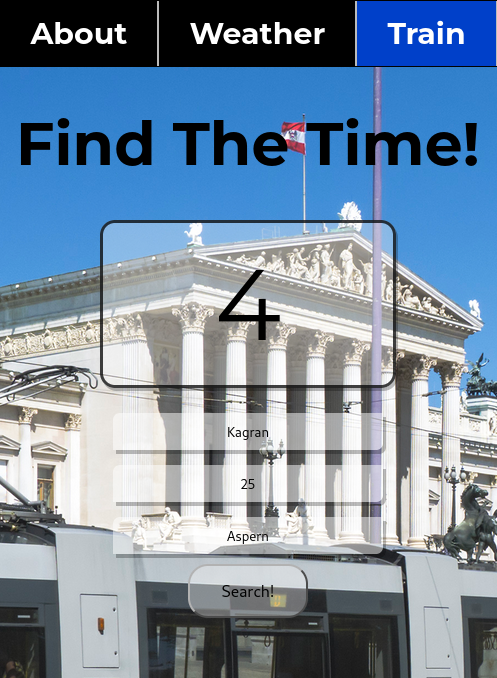

# useless-website

Just a website to play with some APIs and Vue.js. There are two views: one for the weather and other one for the public transport timing.  

## To launch this webapp
1. Go into the frontend directory and run this command: ` npm run serve`. 
2. Go into the backend directory and run this command: `node App.js`. 

## Weather

A simple weather displayer. Type a city name and get the temperature and get the description of the weather.  

   

  

## Train Time

Get the time of the train/bus/metro easily. Just type the start station, line and direction.   

  

